# YT Longform Studio - Sequence Diagrams and Project Memory

This document is a working memory map for the project. It combines sequence
diagrams with notes that should help the next coding session resume quickly.

## Project Memory Snapshot

- User's latest direction (2026-09-13): keep **20 minutes**, enrich the storyboard,
  and preserve the supplied phone/tablet mockups and spotlight. This supersedes
  the earlier 12-minute default. Use `YT_DURATION_SEC=1200`, `YT_SCENE_COUNT=36`
  in local, GitHub Actions, and Vercel environments. OpenAI speed remains 1.08
  with `config.openai.ttsInstructions` for a lively, clear documentary voice.
- Start with ~2,280 words / 8-9 chapters (raised from six on 2026-09-13 so each
  chapter stays narrow and YouTube chapter thumbnails vary more). `generateFullItem()` now measures TTS
  before generating visuals, includes fixed hook/intro/outro durations, and asks
  `enrichLongformDraft()` for new sourced examples, evidence, and perspectives
  when short. Up to three passes / 48 scenes; original narration, chapters,
  spotlight and mediaSource survive insertion. Audio hashes allow reuse after
  reindexing; full narration is retained in the exported storyboard JSON.
- `duration-control.js` fits measured audio using render tempo 0.98–1.12x,
  retimes captions/word triggers, and quantizes scene/subscene durations to frames.
  FFprobe checks final MP4 against the target with a one-second tolerance.
  Impossible fits stop before publishing; never shorten the script or insert
  long silence to reach 20 minutes. Legacy drafts without `durationLocked` keep
  their prior timing behavior. Initial draft gating (`assertNarrationLongEnough`
  and `minimumNarrationWords`) accommodates initial 32-36 scene drafts when
  `durationLocked` is active, leaving duration completion to `enrichLongformDraft()`
  and tempo fitting instead of forcing single-call LLM prompt rewrites that hit output limits.
  AI output quality still requires reviewing a real run.
- Mockups use the existing `assets/phone-mockup.png` and `assets/tablet-mockup.png`.
  Spread ~6–8 relevant placements and up to 22 matched spotlights across the story.
  Prompt and normalizer both use four visual segments, including the end of each
  scene's narration; grid 2x2 generation remains compatible.
- Spotlight has a third type (2026-09-13): `compare`, an animated 2-bar chart
  overlay (pure ASS `\org`/`\fscy`/`\t` scale-from-baseline, no new render
  dependency) for scenes that explicitly compare two named magnitudes (e.g.
  "22x lebih dahsyat dari X", or two numbers with units). Only AI-authored —
  never auto-extracted by `extractAutoSpotlight()`, since guessing a compare
  pair from free text risks fabricating numbers. `normalizeSpotlight()` rejects
  it unless both `value`/`compareValue` are finite positive numbers and both
  labels are present. Shares the same phrase-sync/quota pipeline as
  keypoint/figure (`planSceneSpotlights`), just with a longer card duration
  (6s vs 4.5s) since it has more to read.
- Cold open is now a "flash-forward" (2026-09-13), not a generic setup
  question. `plan.hook` must describe a specific striking moment/fact from the
  MIDDLE/END of the story (question or statement, 15-25 words), and the new
  `plan.flashForwardSceneIndex` field says which scene's visual to use for that
  teaser — `resolveFlashForwardSceneIndex()` validates/defaults it to a
  non-reaction scene around 65% through the story if the AI omits or misaims
  it (never scene 1, since the whole point is spoiling something that hasn't
  happened yet). `insertEnrichmentScenes()` remaps it through `indexMap` when
  scenes get re-indexed by storyboard enrichment. `longform-render.js`'s cold
  open now looks up this scene instead of always `renderScenes[0]`, with the
  old first-scene behavior kept only as a fallback for legacy items missing
  the field. Verified with a real render (QA fixture, 4 distinct-colored
  scenes): cold-open frame showed scene 3's color, not scene 1's.
- Top-left corner overlay is a chapter label now (2026-09-13), not the video
  title repeated for the whole runtime — the title is redundant on screen
  (already on thumbnail/YouTube title). `longform-render.js`'s
  `writeContentCaptionAss()` groups render scenes into contiguous chapter runs
  via `groupScenesForChapterOverlay()` (merges runs starting <10s apart, same
  idea as `buildChapterList()` but also tracks each group's endSec, which that
  function doesn't need) and emits one "BAB N · NAME" event per run, timed to
  when that chapter is actually on screen. `sceneTitleOverlay()` (the old
  static-title version) was removed entirely.
- Overlay text sizing revised again same day after watching a real render:
  first pass hard-truncated long chapter names to 1 line + ellipsis, but the
  user found that "aneh" and asked for the FULL name instead, wrapped smaller
  rather than cut. `fitOverlayText()` (shared by the chapter label AND the
  cold-open hook caption) tries a few (chars-per-line, max-lines, font-size)
  tiers in order and picks the first one that fits the WHOLE text with no
  words dropped; if none of the tiers fit, the last tier is forced with no
  line cap so text is never silently lost. This also fixed a real truncation
  bug: `writeColdOpenCaptionAss` used to hard-slice to 4 lines via
  `splitLines()` (which drops any line past `maxLines`), and the flash-forward
  hook (now 15-25 words, up from 15-20) could overflow that budget — a real
  generated video's hook got cut off mid-sentence because of this.
- Real-render feedback fixes (2026-09-14), all from watching an actual
  generated "Anak Krakatau" video:
  - Mockup/device-overlay images repeated the same subject across many scenes
    (Serper searches for the dominant topic keep returning the same top
    photos). `news-image.js#ensureNewsImages` now tracks `usedSubjects` (a
    normalized-text Set) across both the mediaSource pass and the fallback
    candidate-scene pass, and skips a scene if its resolved query/headline was
    already used — each real-world subject gets at most one mockup per video.
  - Spotlight card fonts (keypoint/figure/compare) enlarged (~15-20%) per user
    request; panel/card heights bumped to match so text doesn't clip.
  - Narration stated wrong years repeatedly. Added an explicit accuracy
    guardrail to both the main storyboard prompt and the enrichment prompt:
    only state a year/date when genuinely confident it's correct, prefer a
    relative phrase ("beberapa dekade kemudian") over a specific year when
    unsure. This is a prompt-level mitigation, not a hard guarantee — AI
    narration should still be spot-checked before publish.
  - Speech tempo/speed was explicitly NOT touched — user likes the current
    pacing, the actual complaint was factual accuracy, not delivery speed.
- Purpose: generate Indonesian YouTube longform educational videos with AI story
  planning, image/B-roll generation, per-scene TTS, subtitle alignment, FFmpeg
  rendering, remote hosting upload, and YouTube publishing.
- Main Node entrypoints: `src/run-once.js`, `src/server.js`,
  `src/preflight.js`, `src/rerender.js`, `src/upload-only.js`,
  `src/sftp-cleanup.js`.
- Vercel API entrypoints: `api/auth.js`, `api/state.js`, `api/run.js`,
  `api/queue.js`, `api/preflight.js`.
- Local desktop app: `app/yt_studio.py`, which runs Node commands locally and
  parses progress markers from stdout.
- Public dashboard: `public/index.html`, `public/app.js`, `public/styles.css`.
- Persistent state: `data/items.json` for active local items and
  `data/memory.json` for compact long-term continuity memory. Remote hosting
  mirrors state under `state/items.json` and `state/memory.json`.
- Generated assets: `generated/images`, `generated/clips`, `generated/audio`,
  `generated/thumbnails`, `generated/videos`, `generated/storyboards`,
  `generated/work`.
- Core invariant before render: every non-reaction scene must have at least one
  video clip or image for each visual segment, and at least one scene audio
  entry must exist.
- External services: OpenAI for story/image/TTS/transcription, ElevenLabs for
  alternative TTS, Pexels for B-roll, Wikipedia for optional fact grounding,
  SFTP/FTP for media hosting, GitHub Actions for cloud generation, YouTube Data
  API for publish/trending/playlist.

## 1. Dashboard Generate Through Vercel and GitHub Actions

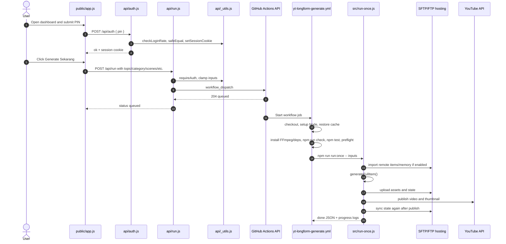

## 2. Dashboard State, Runs, and Queue

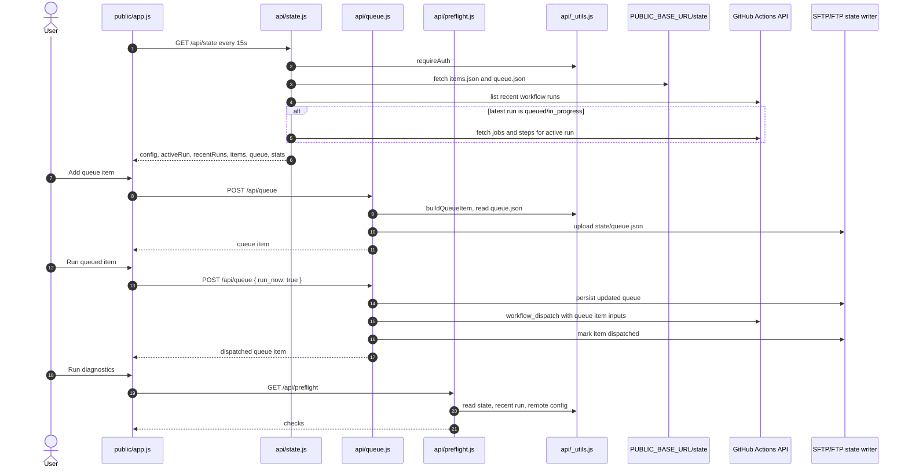

## 3. Longform Generation Pipeline


## 4. Render Assembly

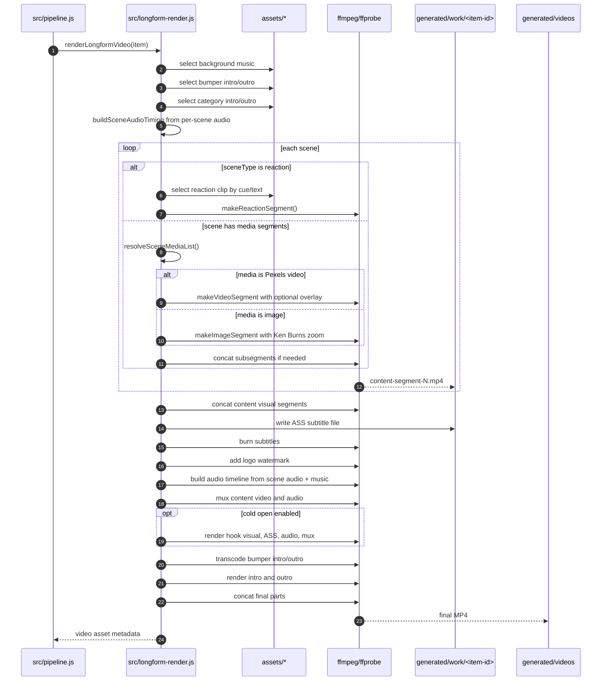

## 5. Local Desktop App Run

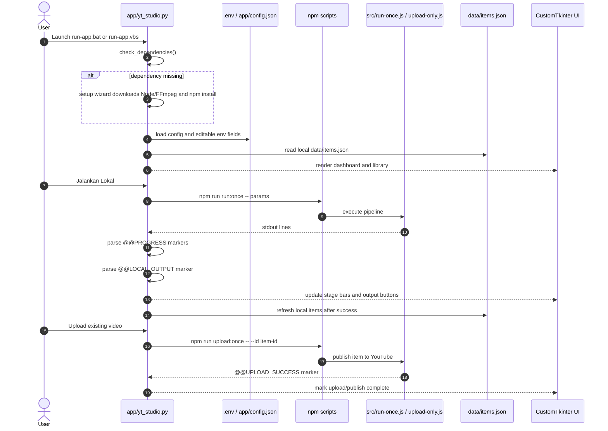

## 6. Continuity Memory Loop

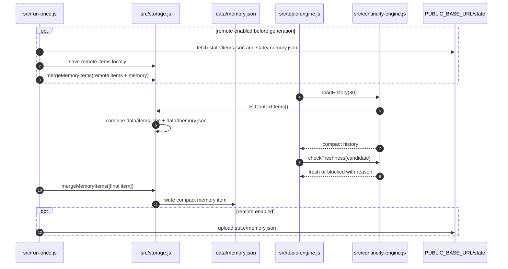

## 7. Story Engine Detail

```mermaid
sequenceDiagram
  autonumber
  participant Pipeline as src/pipeline.js
  participant Story as src/longform-story-engine.js
  participant Topic as src/topic-engine.js
  participant Format as src/format-engine.js
  participant Viral as src/viral-angle-library.js
  participant Continuity as src/continuity-engine.js
  participant Trends as src/youtube-trends.js
  participant Wiki as src/wikipedia.js
  participant OpenAI as OpenAI API
  participant Title as src/title-engine.js
  participant Language as src/story-language.js
  participant Storage as src/storage.js

  Pipeline->>Story: createLongformDraft(rawInput)

  alt topic is empty
    Story->>Topic: pickFreshTopic(category)
    Topic->>Format: pickFormatType()
    Format-->>Topic: formatType (listicle/deep-dive/etc)
    Topic->>Viral: pickViralAngle()
    Viral-->>Topic: viralAngle (id + label)
    Topic->>Continuity: loadHistory(80)
    Continuity->>Storage: listContextItems()
    Storage-->>Continuity: items + memory combined
    Continuity-->>Topic: compact history string
    Topic->>Trends: buildTrendingContext()
    Trends-->>Topic: trending topics for prompt
    Topic->>OpenAI: requestIdeaJson(prompt with history + trends)
    OpenAI-->>Topic: batch of 5+ topic ideas
    Topic->>Continuity: checkFreshness(each candidate)
    Continuity-->>Topic: first fresh idea
    Topic-->>Story: { topic, category, angle, formatType, viralAngle }
  else topic provided
    Story->>Format: pickFormatType()
    Story->>Viral: pickViralAngle()
  end

  Story->>Story: normalizeInput(seed)
  Story->>Wiki: fetchWikipediaFacts(topic)
  Wiki-->>Story: wiki facts + sources (CC BY-SA)
  Story->>Story: buildPrompt(input, wiki)
  Story->>OpenAI: requestKnowledgeJson(prompt)
  OpenAI-->>Story: raw plan JSON

  Story->>Story: normalizePlan(plan, input)
  Story->>Format: buildScenePattern(formatType, sceneCount)
  Format-->>Story: scene type sequence
  Story->>Format: resolveSceneType(scene, pattern)

  alt viral title enabled
    Story->>Title: generateViralTitle(plan, input)
    Title->>OpenAI: requestKnowledgeJson(title prompt)
    OpenAI-->>Title: viral title
    Title-->>Story: viral title string
  end

  alt narration too short
    Story->>OpenAI: requestKnowledgeJson(expansion prompt)
    OpenAI-->>Story: expanded plan
  end

  Story->>Language: polishPlanForLayAudience(plan)
  Language-->>Story: simplified narration
  Story->>Storage: save storyboard JSON
  Story-->>Pipeline: complete item draft
```

## 8. Media Pipeline Detail

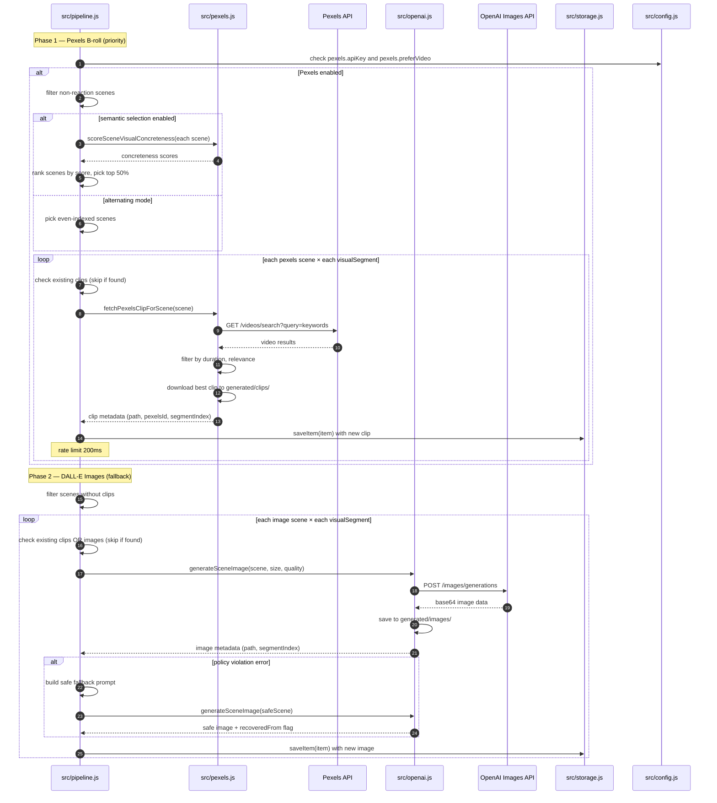

## 9. TTS and Subtitle Pipeline

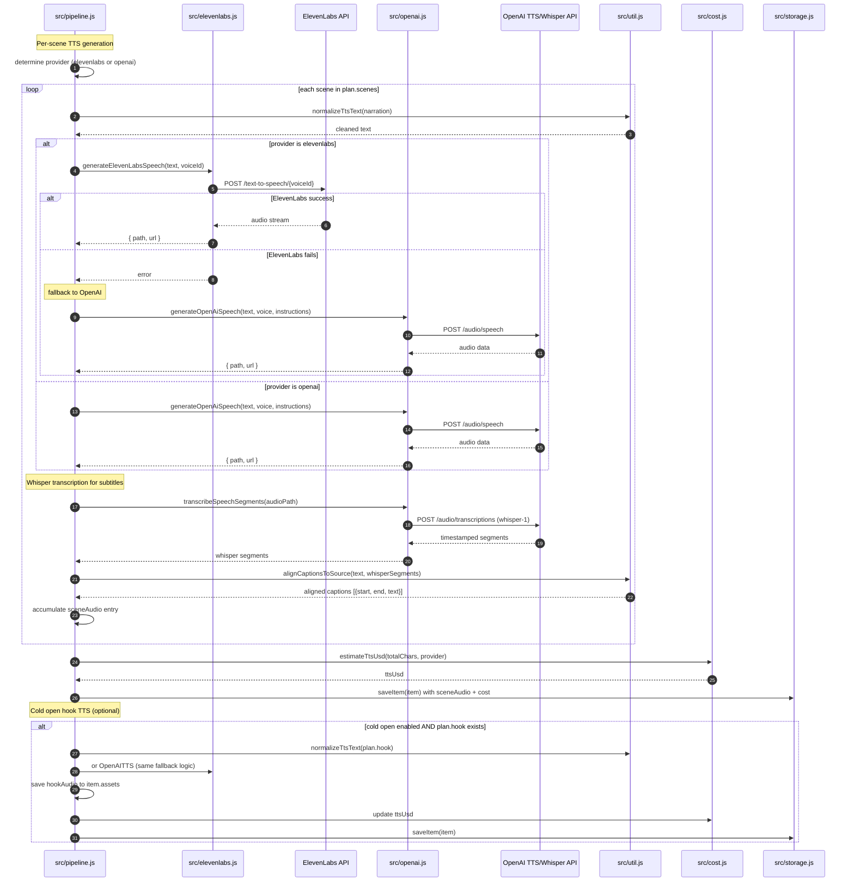

## 10. Thumbnail Generation Flow

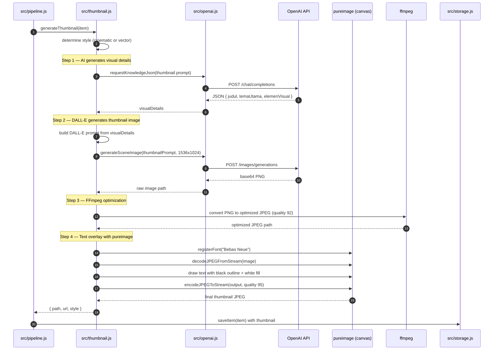

## 11. SFTP Upload and State Sync

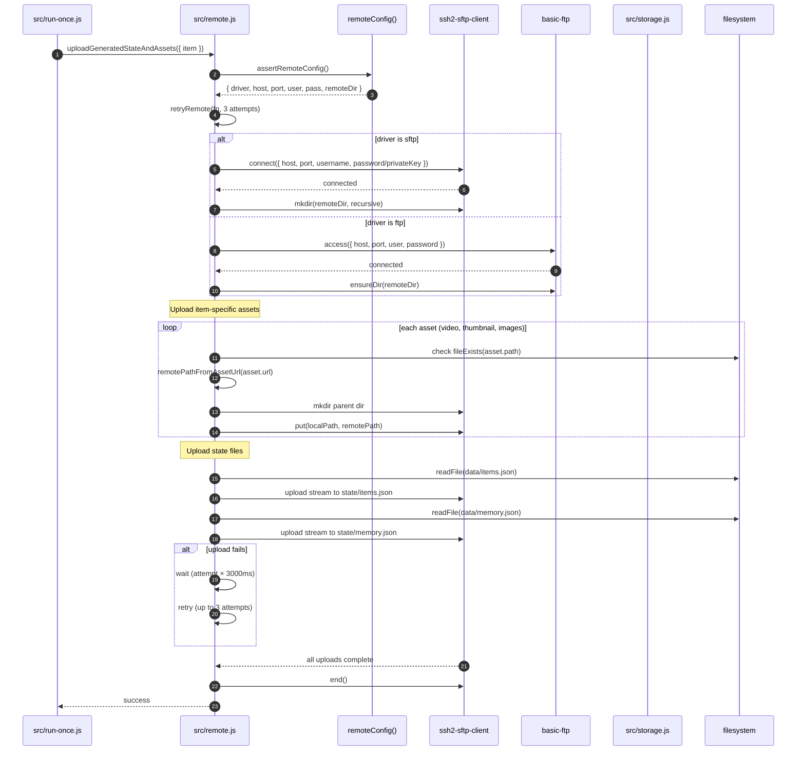

## 12. YouTube Publish and Playlist

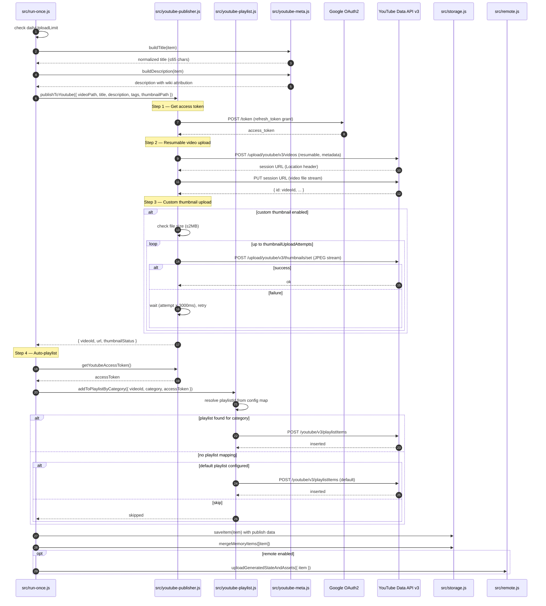

## 13. Module Dependency Graph

```mermaid
graph TD
  subgraph "Entrypoints"
    RunOnce["src/run-once.js"]
    Server["src/server.js"]
    Preflight["src/preflight.js"]
    Rerender["src/rerender.js"]
    UploadOnly["src/upload-only.js"]
    SftpCleanup["src/sftp-cleanup.js"]
  end

  subgraph "Pipeline Core"
    Pipeline["src/pipeline.js"]
    StoryEngine["src/longform-story-engine.js"]
    TopicEngine["src/topic-engine.js"]
    FormatEngine["src/format-engine.js"]
    ViralAngle["src/viral-angle-library.js"]
    TitleEngine["src/title-engine.js"]
    ContinuityEngine["src/continuity-engine.js"]
    StoryLanguage["src/story-language.js"]
    Render["src/longform-render.js"]
  end

  subgraph "External APIs"
    OpenAI["src/openai.js"]
    ElevenLabs["src/elevenlabs.js"]
    PexelsModule["src/pexels.js"]
    Wikipedia["src/wikipedia.js"]
    YTPublisher["src/youtube-publisher.js"]
    YTPlaylist["src/youtube-playlist.js"]
    YTTrends["src/youtube-trends.js"]
    YTMeta["src/youtube-meta.js"]
  end

  subgraph "Infrastructure"
    Config["src/config.js"]
    Storage["src/storage.js"]
    Remote["src/remote.js"]
    Progress["src/progress.js"]
    Cost["src/cost.js"]
    Util["src/util.js"]
    Thumbnail["src/thumbnail.js"]
  end

  subgraph "Vercel API"
    ApiUtils["api/_utils.js"]
    ApiAuth["api/auth.js"]
    ApiState["api/state.js"]
    ApiRun["api/run.js"]
    ApiQueue["api/queue.js"]
    ApiPreflight["api/preflight.js"]
  end

  subgraph "Desktop App"
    YTStudio["app/yt_studio.py"]
  end

  RunOnce --> Pipeline
  RunOnce --> Remote
  RunOnce --> Storage
  RunOnce --> YTPublisher
  RunOnce --> YTPlaylist
  RunOnce --> YTMeta
  RunOnce --> Config
  RunOnce --> Progress

  Server --> Pipeline
  Server --> Storage
  Server --> StoryEngine
  Server --> Config

  Pipeline --> StoryEngine
  Pipeline --> OpenAI
  Pipeline --> PexelsModule
  Pipeline --> ElevenLabs
  Pipeline --> Render
  Pipeline --> Thumbnail
  Pipeline --> Storage
  Pipeline --> Cost
  Pipeline --> Progress
  Pipeline --> Util

  StoryEngine --> TopicEngine
  StoryEngine --> FormatEngine
  StoryEngine --> ViralAngle
  StoryEngine --> TitleEngine
  StoryEngine --> StoryLanguage
  StoryEngine --> Wikipedia
  StoryEngine --> OpenAI
  StoryEngine --> Config
  StoryEngine --> Cost
  StoryEngine --> Util

  TopicEngine --> ContinuityEngine
  TopicEngine --> FormatEngine
  TopicEngine --> ViralAngle
  TopicEngine --> StoryLanguage
  TopicEngine --> YTTrends
  TopicEngine --> OpenAI
  TopicEngine --> Util

  Render --> Config
  Render --> Util
  Render --> Progress

  Thumbnail --> OpenAI
  Thumbnail --> Config
  Thumbnail --> Util

  Remote --> Config

  ApiAuth --> ApiUtils
  ApiState --> ApiUtils
  ApiRun --> ApiUtils
  ApiQueue --> ApiUtils
  ApiPreflight --> ApiUtils

  YTStudio -.->|npm scripts| RunOnce
  YTStudio -.->|npm scripts| UploadOnly
```

## Things To Remember Next Time

- Do not treat `data/items.json` as code. It can be very large and is runtime
  state. Use schema knowledge from storage and summary commands unless a task
  specifically needs item contents.
- Do not open `.env` casually. Use `.env.example` or app/env field definitions
  unless a task explicitly requires secrets.
- Local app and Vercel dashboard are different control surfaces:
  - Vercel dashboard reads remote state and dispatches GitHub Actions.
  - Desktop app reads local `data/items.json` and runs local npm scripts.
- Progress is stdout-based. Any change to `@@PROGRESS`, `@@LOCAL_OUTPUT`, or
  `@@UPLOAD_SUCCESS` must be coordinated with `app/yt_studio.py` and
  `src/server.js` SSE parsing.
- `assertReadyToRender()` is the render gate. If media generation behavior
  changes, update `test/pipeline.test.js`.
- `data/memory.json` is compact continuity memory, not a full item archive. The
  code keeps up to 2000 compact entries.
- Wikipedia grounding adds CC BY-SA source attribution in YouTube descriptions.
  If grounding behavior changes, keep `test/grounding.test.js` aligned.
- Pexels selection is heuristic and intentionally cheap. Concrete visual
  keywords get video priority; abstract scenes fall back to images.
- Pexels candidate semantics are fully ranking-first: hard rejections are
  ONLY technical (excluded id, duration, no landscape mp4). All slug-token
  signals — query coverage AND `mustMatchTerms` — are ranking weights, never
  rejection gates. Rationale: Pexels URL slugs are often generic
  (e.g. "video-855") while the Pexels search API already returns results
  ordered by query relevance, so `selectPexelsCandidate` uses `searchRank`
  (API result order) as the tie-break when slug scores are equal (including
  all-zero). Identity protection (New York vs New Jersey) still works via
  score weights: a matching slug always outranks a mismatched one.
  `PEXELS_MIN_RELEVANCE` is deprecated and ignored.
- Clip quota is `PEXELS_CLIP_RATIO` (default 0.7): up to 70% of eligible
  visual segments get video clips, floor-rounded, minimum 1. The remaining
  segments use generated images.
- Image generation uses a 2x2 grid strategy (`IMAGE_GRID_MODE`, default on):
  each image/summary scene has exactly 4 sequential `visualSegments`, and one
  OpenAI image call produces a 2x2 photorealistic grid that
  `splitGridImage()` (FFmpeg) crops into four 1280x720 panels with a 2% gutter
  inset. Panels for segments already covered by Pexels clips are discarded.
  Grid quality is `IMAGE_GRID_QUALITY` (default medium). If a scene needs only
  1 segment, or the grid call fails after a safe-prompt retry, the pipeline
  falls back to the legacy single-image-per-segment path
  (`generateSceneImage`). `IMAGE_GRID_MODE=off` restores the legacy behavior
  entirely. Grid behavior tests live in `test/grid-image.test.js`.
- Visual switches are synced to speech: `computeSegmentDurations()` in
  `longform-render.js` matches each visualSegment's `narrativeContext`
  (a verbatim 3-8 word phrase from the scene narration, enforced by the
  storyboard prompt) against the word timeline interpolated from
  `sceneCaptions` (Whisper timings), so images change exactly when that idea
  is spoken. Falls back to equal split when captions are missing, phrases
  don't match (score < 0.5), or ordering can't be kept monotonic with the
  minimum sub-segment duration. Tests: `test/segment-sync.test.js`.
- Storyboard prompt enforces knowledge beats (one question per scene in
  beatPurpose, one claim + one concrete evidence, hook ending per scene) and
  chapter-opening scenes must start with a question/prediction that is
  answered progressively across the chapter.
- YouTube publish is resumable upload followed by optional thumbnail upload and
  optional playlist insert.
- SFTP cleanup intentionally avoids `state/` and `thumbnails/`; it sweeps media
  directories only.
- **Graphify knowledge graph** is available at `graphify-out/`. Run
  `graphify extract . --code-only --no-cluster` to refresh after code changes.
  Use `graphify god-nodes` to identify architectural hubs.
- **PRD** is at `docs/PRD.md` — comprehensive product requirements document.
- **AGENTS.md** at project root provides AI agent instructions and conventions.
