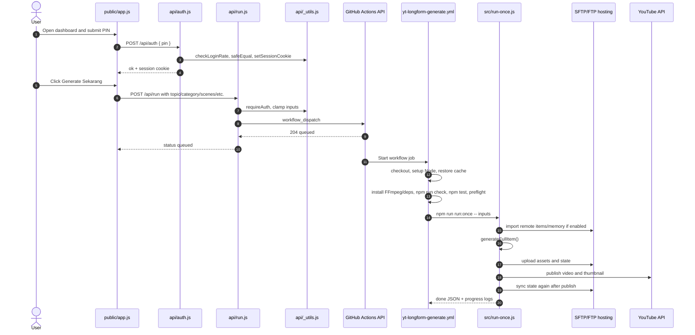
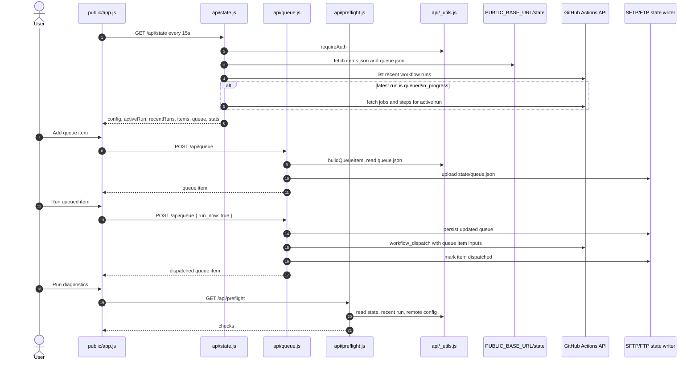
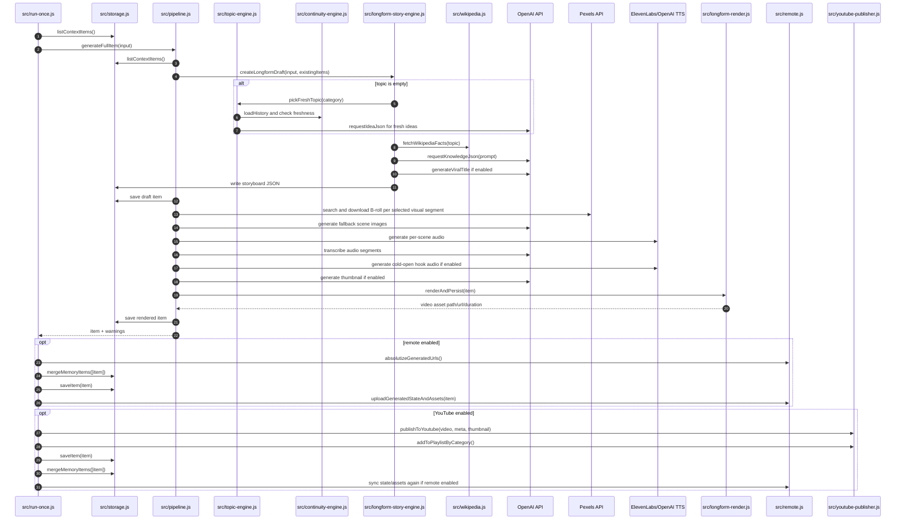
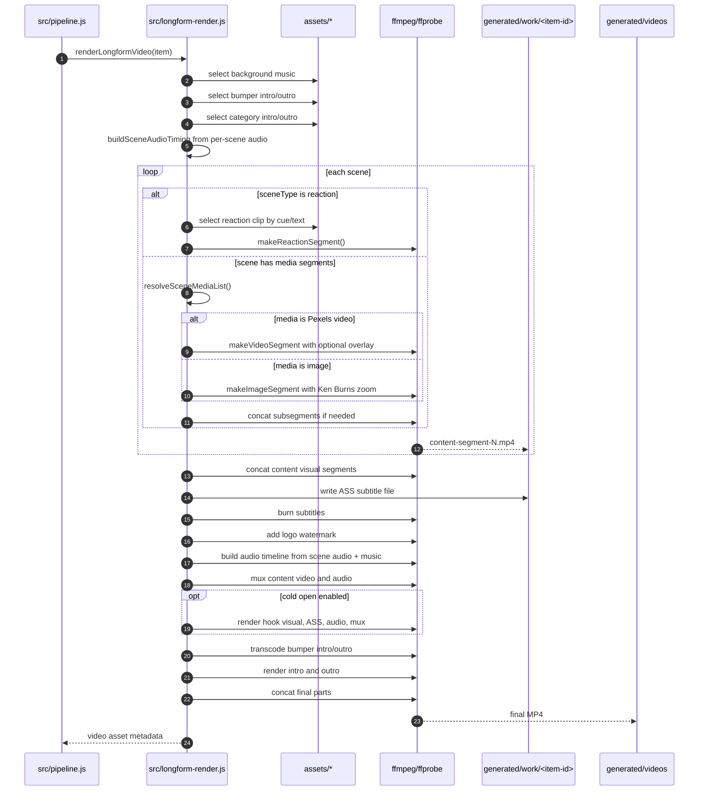
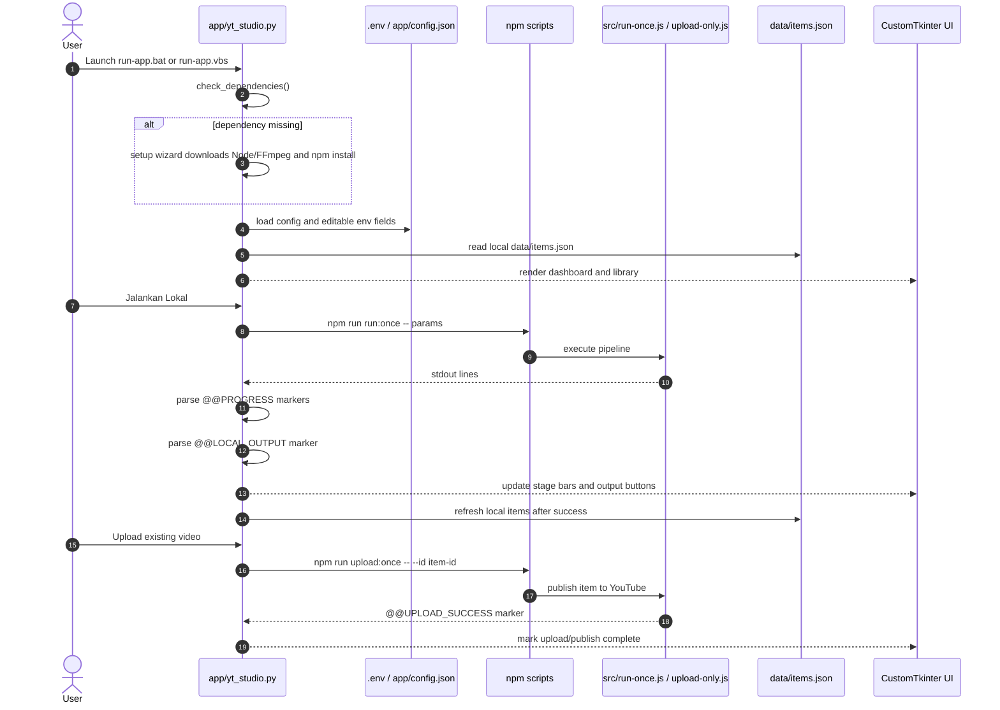
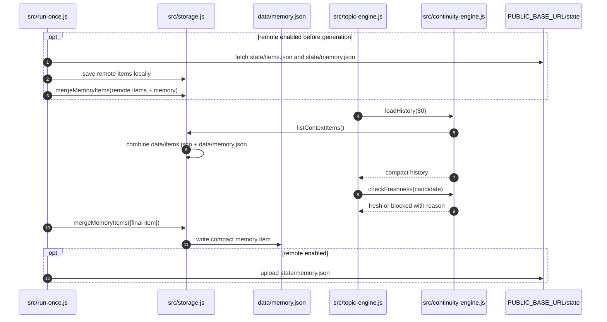

# YT Longform Studio - Sequence Diagrams and Project Memory

This document is a working memory map for the project. It combines sequence
diagrams with notes that should help the next coding session resume quickly.

## Project Memory Snapshot

- Purpose: generate Indonesian YouTube longform educational videos with AI story
  planning, image/B-roll generation, per-scene TTS, subtitle alignment, FFmpeg
  rendering, remote hosting upload, and YouTube publishing.
- Main Node entrypoints: `src/run-once.js`, `src/server.js`,
  `src/preflight.js`, `src/rerender.js`, `src/upload-only.js`,
  `src/sftp-cleanup.js`.
- Vercel API entrypoints: `api/auth.js`, `api/state.js`, `api/run.js`,
  `api/queue.js`, `api/preflight.js`.
- Local desktop app: `app/yt_studio.py`, which runs Node commands locally and
  parses progress markers from stdout.
- Public dashboard: `public/index.html`, `public/app.js`, `public/styles.css`.
- Persistent state: `data/items.json` for active local items and
  `data/memory.json` for compact long-term continuity memory. Remote hosting
  mirrors state under `state/items.json` and `state/memory.json`.
- Generated assets: `generated/images`, `generated/clips`, `generated/audio`,
  `generated/thumbnails`, `generated/videos`, `generated/storyboards`,
  `generated/work`.
- Core invariant before render: every non-reaction scene must have at least one
  video clip or image for each visual segment, and at least one scene audio
  entry must exist.
- External services: OpenAI for story/image/TTS/transcription, ElevenLabs for
  alternative TTS, Pexels for B-roll, Wikipedia for optional fact grounding,
  SFTP/FTP for media hosting, GitHub Actions for cloud generation, YouTube Data
  API for publish/trending/playlist.

## 1. Dashboard Generate Through Vercel and GitHub Actions

## 2. Dashboard State, Runs, and Queue

## 3. Longform Generation Pipeline

## 4. Render Assembly

## 5. Local Desktop App Run

## 6. Continuity Memory Loop

## Things To Remember Next Time

- Do not treat `data/items.json` as code. It can be very large and is runtime
  state. Use schema knowledge from storage and summary commands unless a task
  specifically needs item contents.
- Do not open `.env` casually. Use `.env.example` or app/env field definitions
  unless a task explicitly requires secrets.
- Local app and Vercel dashboard are different control surfaces:
  - Vercel dashboard reads remote state and dispatches GitHub Actions.
  - Desktop app reads local `data/items.json` and runs local npm scripts.
- Progress is stdout-based. Any change to `@@PROGRESS`, `@@LOCAL_OUTPUT`, or
  `@@UPLOAD_SUCCESS` must be coordinated with `app/yt_studio.py` and
  `src/server.js` SSE parsing.
- `assertReadyToRender()` is the render gate. If media generation behavior
  changes, update `test/pipeline.test.js`.
- `data/memory.json` is compact continuity memory, not a full item archive. The
  code keeps up to 2000 compact entries.
- Wikipedia grounding adds CC BY-SA source attribution in YouTube descriptions.
  If grounding behavior changes, keep `test/grounding.test.js` aligned.
- Pexels selection is heuristic and intentionally cheap. Concrete visual
  keywords get video priority; abstract scenes fall back to images.
- YouTube publish is resumable upload followed by optional thumbnail upload and
  optional playlist insert.
- SFTP cleanup intentionally avoids `state/` and `thumbnails/`; it sweeps media
  directories only.

